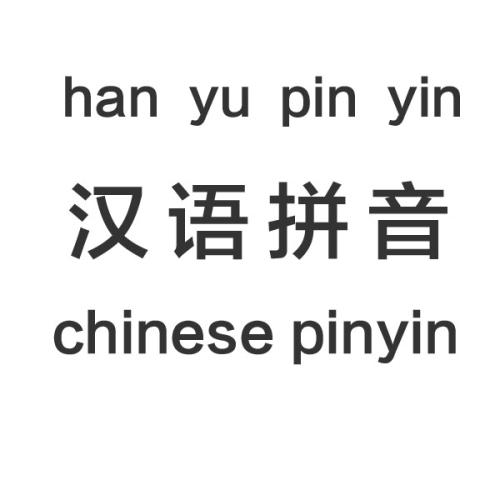

API - 拼音语义算法
========================

.. automodule:: chat.word2pinyin

.. autosummary::

   word2pinyin.sum_cosine
   word2pinyin.match_pinyin
   word2pinyin.jaccard_pinyin
   word2pinyin.pinyin_cut
   word2pinyin.similarity_pinyin
   
根据语义分词Cosine相似性矩阵计算语义 jaccard 模型的各个参数
------------------------
.. autofunction:: word2pinyin.sum_cosine

计算两个拼音的相似度得分
------------------------
.. autofunction:: word2pinyin.match_pinyin

计算两个拼音向量的语义 jaccard 相似度得分
------------------------
.. autofunction:: word2pinyin.jaccard_pinyin

将句子切分为拼音向量
------------------------
.. autofunction:: word2pinyin.pinyin_cut

基于拼音向量的语义 jaccard 句子相似度得分
------------------------
.. autofunction:: word2pinyin.similarity_pinyin
